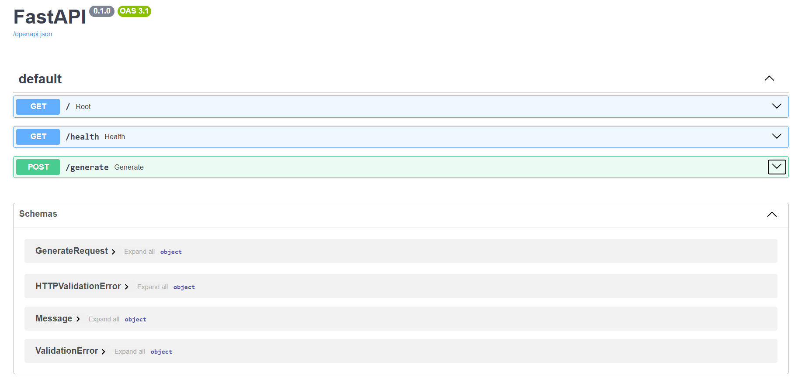
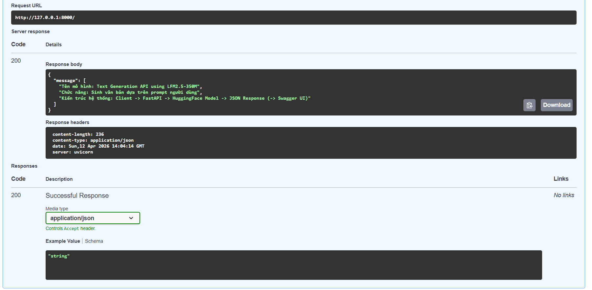
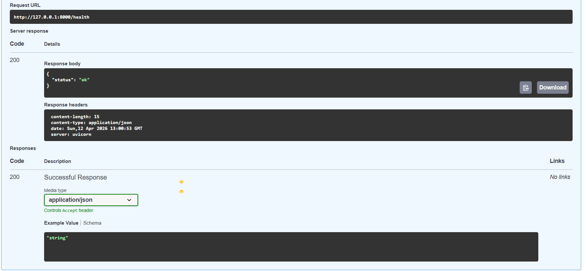
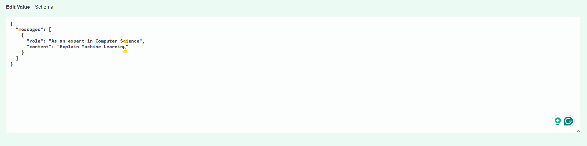
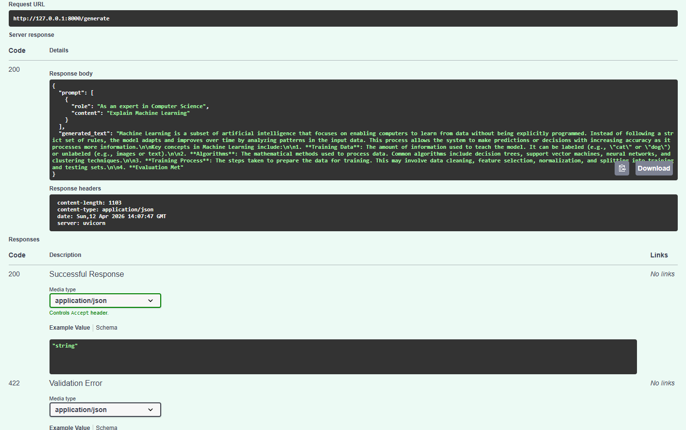

# Bài tập lab môn TH-Tư duy tính toán

## 📃Thông tin sinh viên
- Họ và tên: Trần Văn Đức
- MSSV: 24120042
- Lớp: 24CTT5


## 💻Thông tin mô hình
- Tên mô hình: _**LFM2.5-350M**_.
- Author: **_Liquid AI_**.

<p align=center>
  
</p>
  
- Distributer: **_Hugging face_**.

<p align=center>
  
</p>

- Link Url: **https://huggingface.co/LiquidAI/LFM2.5-350M**
- Chức năng của hệ thống:
  - Sinh văn bản (text generation) dựa trên prompt người dùng
  - Hỗ trợ định dạng hội thoại (chat-based input)
- Luồng hoạt động: Client → FastAPI → Model (LFM2.5-350M) → Response JSON

## ⚙️ Cài đặt thư viện
### Bước 1: Clone repo
Dùng git bash, nhập lệnh:

    $ git clone https://github.com/tvdeev206/FastAPIProject.git
    $ cd FastAPIProject

### Bước 2: Cài đặt môi trường ảo
Dùng python terminal, nhập lệnh:

    $ python -m venv venv
    $ venv\Scripts\activate  

### Bước 3: Cài đặt thư viện
Dùng python terminal, nhập lệnh:

    $ pip install -r requirements.txt


## ▶️ Hướng dẫn chạy chương trình
### Bước 1: Khởi động API Server
Dùng python terminal, nhập lệnh:

    $ uvicorn main:app --reload

Khi này trên terminal sẽ thông báo: 

    INFO:     Will watch for changes in these directories: ['C:\\Users\\Windows\\PycharmProjects\\FastAPIProject']
    INFO:     Uvicorn running on http://127.0.0.1:8000 (Press CTRL+C to quit)
    INFO:     Started reloader process [28432] using WatchFiles

Tức là Server đã được khởi tạo và được host ở http://127.0.0.1:8000.

Khi này ta có thể copy URL và paste lên web hoặc ấn vào link URL.

Nhưng khi này ta chưa gửi request nên sẽ web sẽ không load được.

### Bước 2: 
Mở thêm một terminal và nhập lệnh:

    $ python test_get.py
    
hoặc

    $ python test_gethealth.py
    
hoặc

    $ python prompt.py
  
- Với _test_get.py_ file, thì ở trên web và terminal sẽ hiện một đoạn giới thiệu về mô hình, chức năng của mô hình và kiến trúc của hệ thống.
- Với _test_gethealth.py_ file, thì ở terminal sẽ hiện ra tình trạng của hệ thống ở dạng JSON

      {'status': 'ok'}
  
- Với _prompt.py_ file, thì terminal sẽ cần cung cấp input đầu vào là "prompt" và "role", khi này ta cần nhập dữ liệu đầu vào, sau đó thì terminal sẽ hiện ra output là văn bản dựa trên input đầu vào, ví dụ:

   Dữ liệu đầu vào:

      $ Enter a prompt: Explain Machine learning
      $ Enter a role: As an expert in Computer Science

   Dữ liệu ra:
  
      {'prompt': [{'role': 'As an expert in Computer Science', 'content': 'Explain Machine learning'}], 'generated_text': 'Machine learning is a subset of artificial intelligence that focuses on enabling computers to learn from data without being ex
      plicitly programmed. Instead of following a strict set of rules, machine learning algorithms analyze patterns in large datasets to make predictions or decisions.  \n\nThe process typically involves three stages:  \n1. **Data Collection** – Gat
      hering relevant information from sources like sensors, websites, or databases.  \n2. **Feature Extraction** – Identifying the most important features or variables that contribute to the outcome.  \n3. **Model Training** – Using the extracted f
      eatures to train a statistical model, which learns from the data to improve its accuracy over time.  \n\nMachine learning excels in scenarios where data is abundant and complex, such as image recognition, natural language processing, recommend
      ation systems, and predictive analytics. It is widely applied in industries like healthcare, finance, marketing, and autonomous vehicles, where the ability to adapt and improve continuously is critical.  \n\nWould you like me to also explain **how'}

## * Cách 2:
### Bước 1: Cài đặt lệnh của fastapi
Tại python terminal, nhập lệnh:

    $ pip install "fastapi[standard]"

Sau đó, nhập lệnh: 
    
    $ fastapi dev 

Khi này ở terminal sẽ xuất hiện 

```console
 ╭────────── FastAPI CLI - Development mode ───────────╮
 │                                                     │
 │  Serving at: http://127.0.0.1:8000                  │
 │                                                     │
 │  API docs: http://127.0.0.1:8000/docs               │
 │                                                     │
 │  Running in development mode, for production use:   │
 │                                                     │
 │  fastapi run                                        │
 │                                                     │
 ╰─────────────────────────────────────────────────────╯

INFO:     Will watch for changes in these directories: ['/home/user/code/awesomeapp']
INFO:     Uvicorn running on http://127.0.0.1:8000 (Press CTRL+C to quit)
INFO:     Started reloader process [2248755] using WatchFiles
INFO:     Started server process [2248757]
INFO:     Waiting for application startup.
INFO:     Application startup complete.
```

### Bước 2:
Nếu ta vào **http://127.0.0.1:8000** thì sẽ như cách 1.

Thay vào đó ta vào **http://127.0.0.1:8000/docs**, thì khi này sẽ xuất hiện một GUI với cấu trúc như hình

<p align=center>
  
</p>

Với từng request ta đã thiết kế, thì sẽ cho ra từng response tương ứng.

Ta có thể test từng request bằng cách ấn nút "Try it out", và ấn nút "Execute". 
- default GET

<p align=center>
  
</p>

- GET health 

<p align=center>
  
</p>

Với _/generate_ request, thì ta phải thêm input trong phần "Edit value" sau khi đã ấn nút "Try it out", sau đó ấn nút "Execute".

- Input: 

<p align=center>
  
</p>

- Output:

<p align=center>
  
</p>

## 🎦 Liên kết video demo
Link Drive: https://drive.google.com/file/d/1uJ_vNEqMPwdsWDQAlHb6CiKxAEYRKr25/view?usp=sharing
